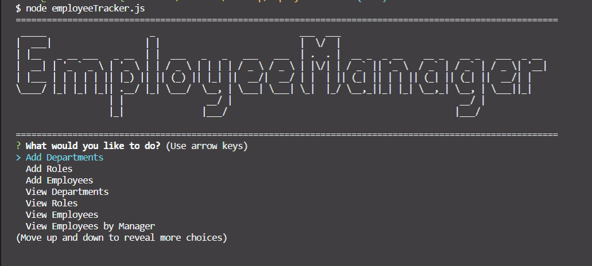
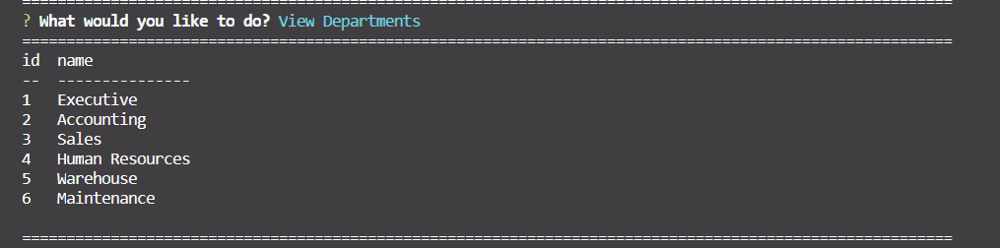
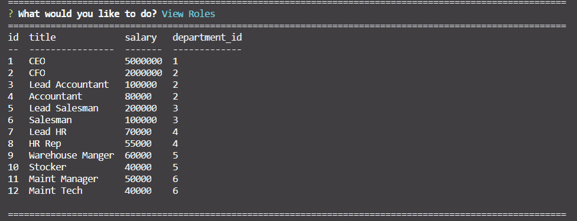
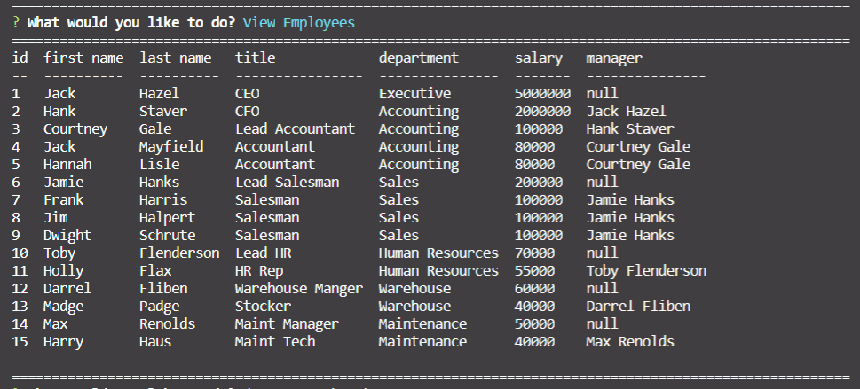

# Company Employee Tracker (CLI)




## Description 

In todays world managing employees, their roles, salaries and managers can be a complicated thing. This app was built to help manage that. With the help of a SQL database this app will allow you to create, manage, update and delete company data. Right now this is a command line application, I plan on making this into a web app that will still use SQL to have a much friendlier interface.

## Usage

In order to use this app you will need [NodeJS](https://nodejs.org/en/) and [SQL](https://www.mysql.com/) Database installed. Once you get these installed you can perform a simple
```
npm install
```
This will install all of the required dependencies to run the program. After this you can start the app by doing a
```
node employeetracker.js
```
Now you are in the application. There are plenty of choices to see the departments, roles, and employees associated to your business. Follow the prompts and the instructions will be self explanitory.







```
A schema.sql and a seed.sql is provided for the database layout and some sample data to use if you would like
```

## Credits

Website is built with [NodeJS](https://nodejs.org/en/), [ExpressJS](https://expressjs.com/), HTML, CSS, and JS

## License

Copyright (c) Allister Rampenthal. All rights reserved.

Licensed under the [MIT](https://choosealicense.com/licenses/mit/) license
